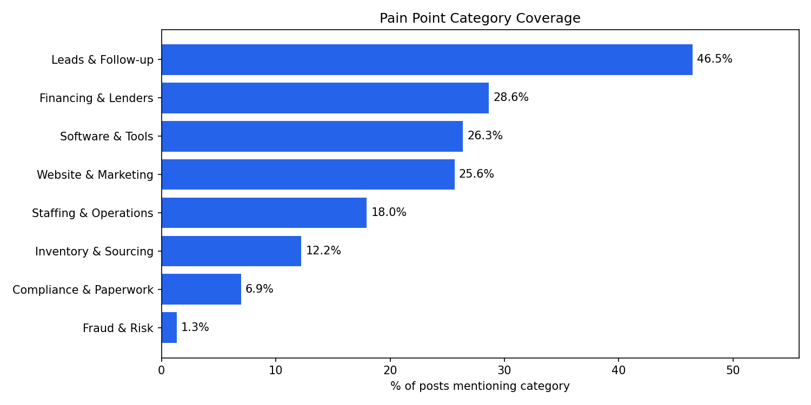

# Independent Dealer Market Research

A data-driven market research project to identify pain points and product opportunities 
in the independent used car dealer space, conducted prior to building a B2B mobile app.

## Overview

Before writing a single line of app code, this research project was conducted to validate 
whether a real problem existed worth solving. The goal was to identify specific, 
recurring pain points that independent used car dealers experience in their daily 
operations — and determine whether any of those pain points represented a viable 
point solution opportunity.

## Methodology

### 1. Data Collection
Scraped publicly accessible forums on DealerRefresh, targeting two subforums:
- NIADA Independent Dealer Forum
- CRM / ILM / DMS subforum

**Tools:** Python, `requests`, `BeautifulSoup`

### 2. Quantitative Analysis
Ran keyword frequency analysis, pain point category coverage, and post volume 
trends across 835 posts from 131 threads by 233 unique authors.

**Tools:** Python, `pandas`, `matplotlib`, `wordcloud`

### 3. Qualitative Analysis
Batched post content and sent it to the Claude API (Anthropic) for structured 
pain point extraction. Each post was analyzed for:
- Pain point description
- Workflow affected
- Severity (high / medium / low)
- Verbatim signal phrase
- Workaround mentioned

**Tools:** Python, Anthropic SDK, Claude Sonnet

### 4. Synthesis
Aggregated 336 extracted pain points across 8 workflow categories and identified 
the highest-signal opportunities based on severity and workaround density.

## Key Findings

### Pain Points by Workflow Category
| Category | Pain Points | High Severity |
|---|---|---|
| Software & Tools | 96 (28.6%) | 56 |
| Lead Follow-up | 52 (15.5%) | 32 |
| Operations | 48 (14.3%) | 21 |
| Reporting | 36 (10.7%) | 14 |
| Financing | 30 (8.9%) | 22 |
| Communication | 30 (8.9%) | 15 |
| Compliance | 24 (7.1%) | 18 |
| Inventory Sourcing | 20 (6.0%) | 8 |

### Top Opportunities Identified
- **Lead management for solo operators** — one person handling all leads manually 
  with no affordable CRM solution matching their scale
- **Recall compliance tracking** — dealers manually checking VINs one by one; 
  affordable automated solutions largely absent at the independent dealer price point
- **Inventory sourcing** — eliminated as a technology problem; identified as a 
  structural supply scarcity issue that no app can solve

### Product Decision
Based on this research, the lead management opportunity was selected for development. 
The result is [Lead Tracker](https://github.com/mikeb1869/lead-tracker), a Flutter 
mobile app for independent used car dealers.

## Project Structure
```
dealerrefresh_scraper.py    # Scrapes forum threads and posts
analyze_posts.py            # Quantitative analysis and chart generation  
pain_point_analyzer.py      # Sends posts to Claude API for pain point extraction
summarize_pain_points.py    # Aggregates and ranks extracted pain points
```

## Charts




## Tech Stack

- **Python** — scripting and data analysis
- **BeautifulSoup** — HTML parsing and web scraping
- **pandas** — data manipulation
- **matplotlib** — data visualization
- **wordcloud** — word frequency visualization
- **Anthropic SDK** — LLM-powered qualitative analysis

## Context

This research was conducted by a career changer transitioning into software 
development with 15 years of experience in auto retail at CarMax. Domain expertise 
in the industry informed both the research design and the interpretation of findings.